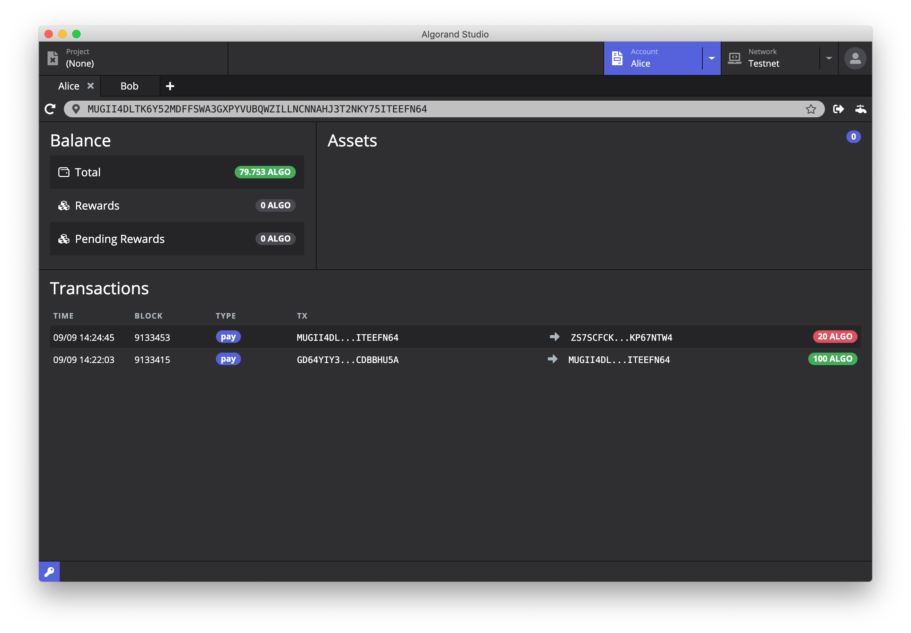
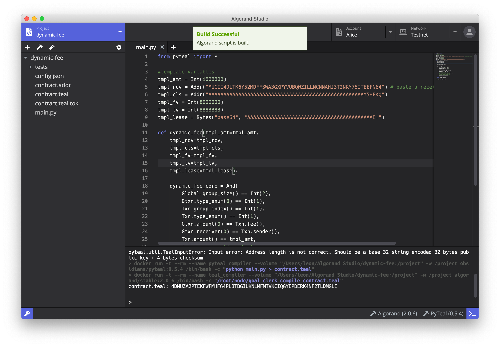

# 教程一

## 简介

本篇为第一篇教程，将简单介绍如何安装使用 Alogrand Studio，然后通过 DynamicFee 项目来展示 Alogrand 开发的完整流程。

## 准备工作

### 安装Algorand Studio

请在 GitHub [下载页面](https://github.com/ObsidianLabs/AlgorandStudio)下载 Algorand Studio。目前 Algorand Studio 支持 macOS 和 Linux 系统，请根据系统下载对应的版本。

正确安装 Algorand Studio 将显示欢迎页面，根据提示完成 Docker, Algorand Node 以及 PyTeal Compiler 的下载、安装及启动。

  

### 启动 Algorand Node 并连接到测试网

Algorand Studio 在创建 Algorand Node 实例的时候会帮助用户自动下载 snapshot，用于快速更新之前的数据。

  

完成 snapshot 的下载后 Algorand Node 实例将出现在列表中，点击 *Start* 就可以启动 Algorand node。

目前 Algorand Studio 仅支持测试网。

### 创建Algorand地址

完成 Algorand Node 的启动后，首先需要创建钥匙对来完成后续的合约部署以及调用。

有别于一般的密钥对，Algorand 密钥对中的私钥是以助记词的形式储存的。

在 Algorand Studio 的任意界面，点击应用左下⻆的钥匙图标，打开密钥管理器。点击 *Create* 按钮打开新钥匙对弹窗，输入钥匙对的名字并点击 *Save* 按钮。完成后将在密钥管理器中看到刚刚生成的钥匙对的地址。钥匙对由私钥和公钥组成，公钥在智能合约中也常被称作地址。

导出私钥可以通过点击每个地址后面的眼睛按钮打开查看私钥弹窗，弹窗显示地址以及私钥。后续教程中会需要通过管理器导出私钥。

  

为了顺利完成接下来教程，首先需要创建三个钥匙对并命名为：Alice，Bob 和 Charlie。

## 基础操作

### 使用浏览器

点击顶部 *Account* 标签打开账户浏览器，并在地址栏粘贴 Alice 的钥匙对地址，可以在左边看到当前地址的 ALGO 余额信息。下方可以看到每一笔交易的信息。

  

### 通过Faucet申请token

在区块链的世界中，大家通常将申请测试 Token 的方式称为 faucet，目前在测试网络下每次 faucet 申请到的 Token 为 100 ALGO。

点击地址栏旁的水龙头按钮，将弹出一个 *Algorand dispenser* 页面，在页面中申请 Token。

  

完成申请后稍等片刻，刷新页面后可以看到 Alice 的余额更新为 100 ALGO，并且下方 *Transactions* 列表中多了一条转账记录。

### 转账

开始转账前我们新增一个标签页，并将 Bob 的地址粘贴到地址栏，回车后可以看到 Bob 的账户余额信息为 0 ALGO。

点击地址栏旁的 *Transfer* 按钮，输入转账总数和收款人 *Recipient* 地址，这里填 Bob 的地址，点击 *Sign and Send*。

  

完成后再次刷新页面，Alice 的余额变为 79.753 ALGO，Bob 的余额为 20 ALGO，这是因为除了给 Bob 转出的 20 ALGO 外，还有从 Alice 账户中扣除的转账手续费。

## Algorand smart contract (ASC)

TEAL是原生写 Algorand 智能合约语言，它是一种类似 Assembly 的语言，由 Algorand 官方开发。

https://developer.algorand.org/docs/reference/teal/specification/

### 创建项目（模板DynamicFee）

点击顶部 *Project* 标签，点击 *New* 按钮，填入项目名称和模版，这里选择 *Dynamic Fee* 模版，点击 *Create* 按钮完成项目的创建。

  

### PyTeal vs TEAL

使用 TEAL 编写代码并不方便，为此 Alogrand 开发了 PyTeal。Pyteal 是通过 Python 语法来编写代码，然后通过 Pyteal 编译器编译成 teal，然后编译成二进制。

https://developer.algorand.org/docs/features/asc1/teal/pyteal/

### 编译合约

在编译 Dynamic fee 前，我们还需要修改一下 `main.py` 的代码，在第 5 行代码中填入接受转账的账户地址。

在编辑器底部有两个锤子按钮，后面跟着版本号，这两个分别是 Pyteal 的编译器和 Teal 的编译器。Algorand Studio 会使用这两个编译器一起进行编译。

  

其中 Pyteal 编译器负责将 `.py` 文件编译成 `.teal` 文件，Teal 编译器负责将 `.teal` 文件编译成 `.tok` 和 `.addr` 文件。

`.addr` 是合约的地址，相当于合约代码的哈希地址。

点击工具栏的锤子按钮进行编译，编译完成后的合约不需要部署，只需要在调用时附加合约代码(`.tok`)，通过地址即可检查代码是否真实。

### 合约代码

Dynamic fee 合约实现了一个代付交易费的功能。上文中的转账交易费是由 Alice 来支付的，如果使用 Dynamic fee 合约来进行转账，是可以由别的账户来支付这笔交易费。

合约代码具体解析参见：

https://developer.algorand.org/docs/reference/teal/templates/dynamic_fee/

## 构造交易 & 调用合约

Alogrand Studio 通过 json 文件来定义交易。

在项目下的 `test` 文件夹中可以找到 8 个 json 文件，分别对应着 8 种不同类型的交易。

  

### 构造普通交易

#### 普通转账 pay

我们将展示如何使用 json 文件来进行转账交易。

打开 test 文件夹下的 `pay.json` 文件，从这个文件中可以看到定义这笔交易的所有信息，其中包括了方法名称 pay，支付地址，接受地址，支付金额等信息。其中账户地址可以直接使用 *Keypair Manager* 中的名字，Alogrand Studio 将使用名字进行索引替换为地址。

从 `1.pay.json` 文件中可以看出，这笔交易的定义的是从 Alice 转账给 Bob 10 个 ALGO，并使用 Alice 进行签名。

点击试管按钮，在弹出的窗口中选择 `1.pay.json`，然后点击 *Run Test Transaction* 按钮，稍等片刻等待交易完成。

  

交易完成后切换至区块浏览器并刷新 Alice 页面，可以看到余额减少了 10 个多一点的 ALGO，下方的交易记录中也多出了刚刚的那笔转账记录。

#### atomic transfer

atomic transfer 保证多笔交易同时成功和同时失败。

https://developer.algorand.org/docs/features/atomic_transfers

#### multisig

multisig 支持多个账户给这笔交易签名。

https://developer.algorand.org/docs/features/accounts/create/#multisignature

### 调用合约

Algorand 的智能合约有 Stateful 和 Stateless 两种类型，本教程使用的是 Stateless 类型的智能合约。

更多 Stateless 相关的合约请查看：

https://developer.algorand.org/docs/features/asc1/stateless

#### Contract Account vs Delegated Approval

Stateless Smart Contracts 使用 LogicSig 作为合约签名的方式。通常 Stateless Smart Contracts 有两种使用场景，分别为 Contract Account 和 Delegated Approval

- Contract Account： 合约作为交易中间方，交易方将资金存入合约，当交易双方达到交易条件时由合约本身进行转账
- Delegated Approval： 合约作为交易点方，仅负责检查交易，不负责资金流转

更多 Contract Account 和 Delegated Approval 相关的信息请查看：

https://developer.algorand.org/docs/features/asc1/stateless/modes

#### 调用Dynamic Fee合约

打开 `8.contract_delegated.json` 文件，该 json 文件描述了两笔交易，第一笔是 Bob 给 Alice 转的 0.001 ALGO，第二笔是 Alice 给 Charlie 转的 1 ALGO。

这两笔交易合并起来看是 Alice 给 Charlie 转了 1 ALGO，而 Bob 为这笔交易支付了 0.001 ALGO 的转账手续费，结果就是 Alice 不需要为这笔转账支付手续费。

点击工具栏上的试管按钮，在弹出窗口中选择 `8.contract_delegated.json` 并点击 *Run Test Transaction* 按钮，稍等片刻等待交易完成。

交易完成后切换至区块浏览器并刷新 Alice, Bob 和 Charlie 页面，可以看到 Alice 的余额减少了 1 ALGO，Bob 减少了 0.002 ALGO（除了为 Alice 支付的转账费用外，还有自身的转账费用） 而 Charlie 增加了 1 ALGO。

Alice 的交易记录中多了两条交易记录，分别为给 Charlie 的 1 ALGO 转账和收到 Bob 的 0.002 ALGO 转账。
