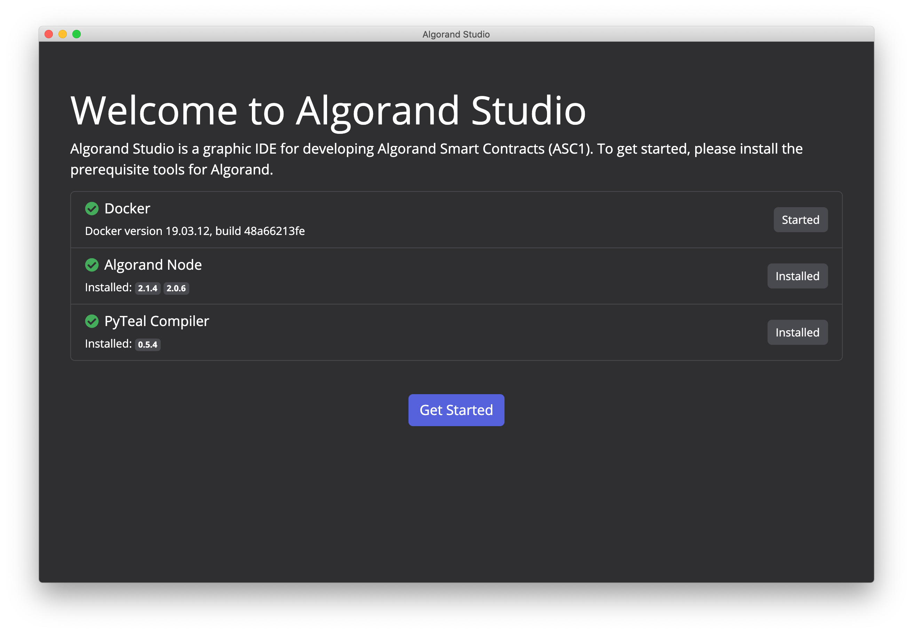
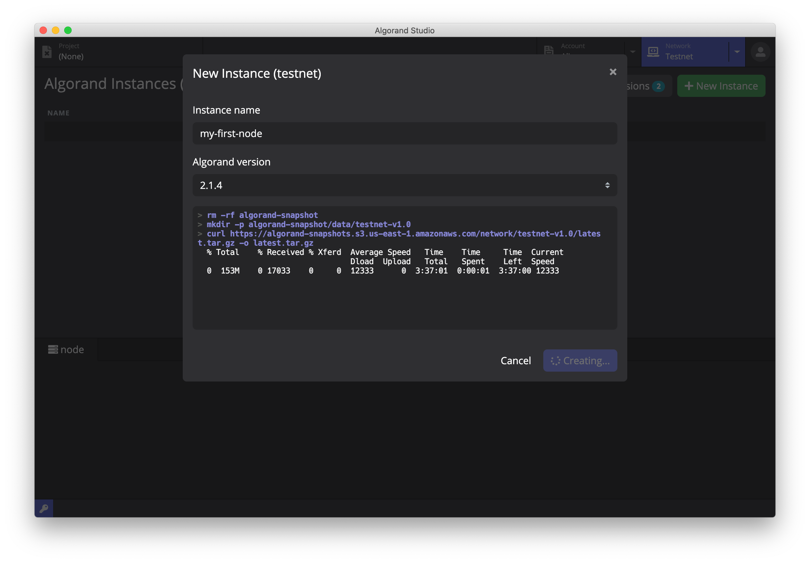
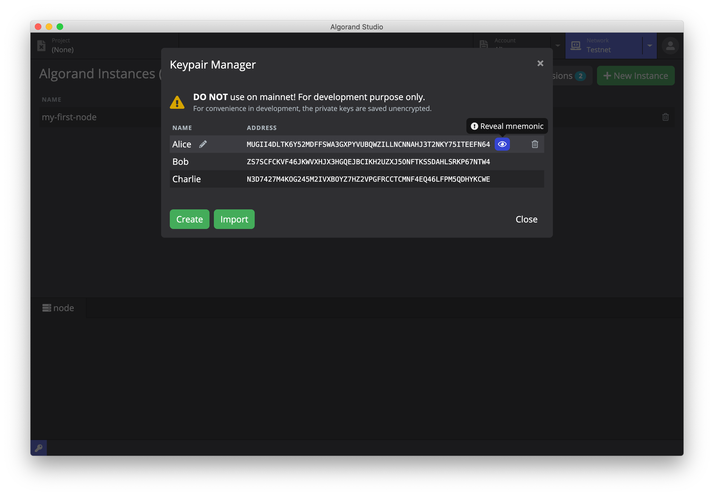
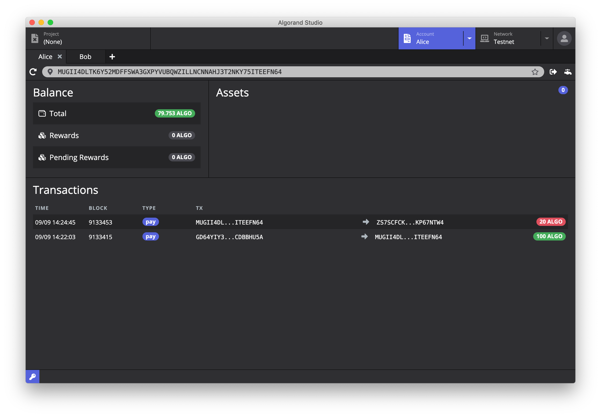
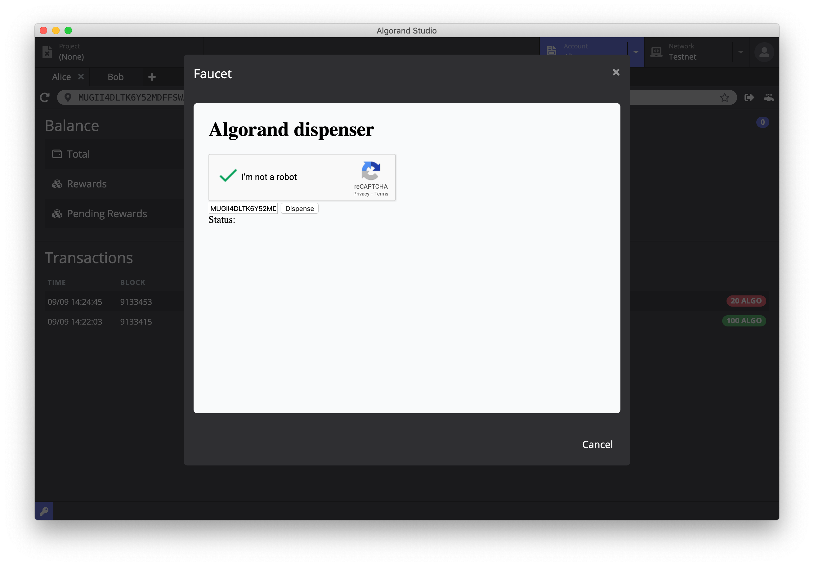
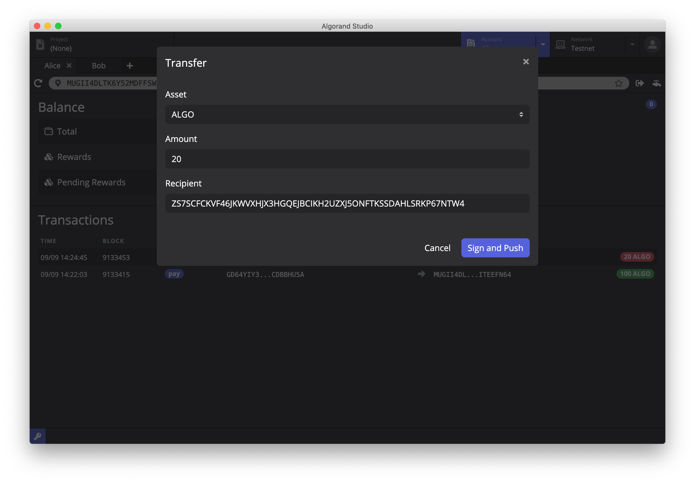
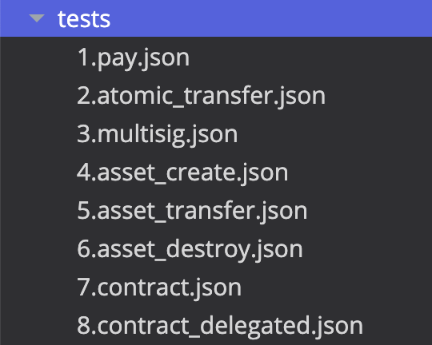
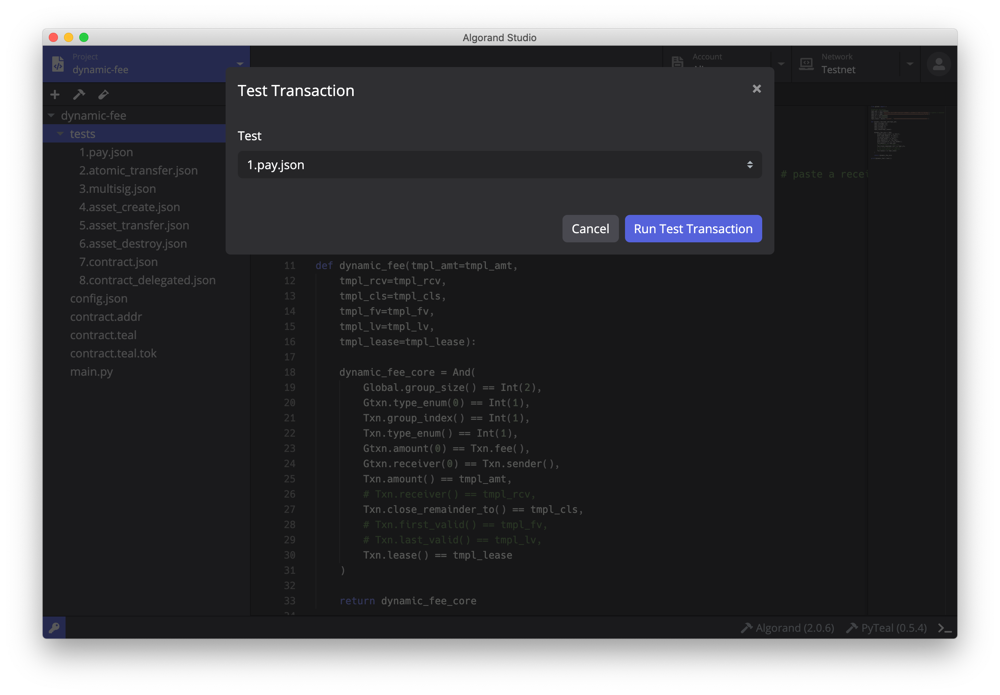

# Tutorial One

## Intro

This is the first article of our Algorand Development Tutorial series. We will introduces basics and preparation of Algorand Studio, then illustrate a complete Algorand development lifecycle with DynamicFee project.

## Preparation Work

### Installing Algorand Studio

You may download latest build of Algorand Studio from our Github release page [Link](https://github.com/ObsidianLabs/AlgorandStudio). Algorand Studio currently supports macOS and Linux operating systems while we're working hard to extend it to other platforms. 

Download, install and run Algorand Studio on your device, if everything works as it should be, you will be brought to a welcome screen where you shall see a checklist of prerequisites for Algorand Studio. Algorand Studio requires Docker runtime, Algorand Node and PyTeal Compiler to proper function, therefore we put it here to simplify your preparation work. Click the button at the end of each of the items and complete installation as per instruction. 

  

### Start Algorand Node and connect to the test network

Algorand Studio automatically downloads snapshot when you creates a new Algorand Node instance. 

  

When snapshot is fully downloaded, an Algorand Node will show up on the list. Click *Start* to start the Algorand Node.

Algorand Studio only supports test network at this moment.  

### Create Algorand address

After you successfully start up Algorand Node, you need to create a keypair to support contract deployment and contract call.

Unlike ordinary keypairs, the private keys in Algorand keypairs are stored in the form of mnemonic.

Click the key icon on the bottom left corner on Algorand Studio to open Keypair Manager, then click *Create* button. A popup window will guide you through the process by putting in the name of the keypair then click *Save* button. Once it completes, you shall see the keypair addresses we you just created in the Manager, A keypair are composed of public key and private key, while the public key is also commonly named the address in smart contracts.

You may also export private keys by clicking the eye icon at the end of each address, when a popup window showing address and private key will guide you through the export process. We will showcase this process later in this tutorial.

  

In this tutorial, you need to create three keypairs after names, Alice, Bob and Charlie. Alice, Bob and Charlie will be referenced wherever we need a keypair in this tutorial.

## the Basics

### Using the Explorer

Click the *Account* Label on the top to open the *Account Explorer* and paste Alice's keypair address in the address column. You should see its ALGO balance on the left and every transaction on the bottom relating to the specified address.

  

### Application of Token through Faucet

In the world of Blockchain, people usually refer the method to apply for test token as Faucet. Currently, you will be granted 100 ALGO each time when you faucet for test tokens.

Click the faucet button next to the address column, a window named *Algorand Dispenser* will pop up where you can apply for test token.

  

Minutes following your applcation, you will see Alice's balance go up by 100 ALGO where a new transfer transaction is recorded in the *Transactions* list.

### Transfer

To start a transfer, you need to create a new tab, and type in Bob's address into the address column. Press ENTER and you'll see Bob's current account balance, which is 0 ALGO.

Then press Transfer button next to the address column. Type in the amount to be transferred and the recipient's address, which in our case, is the address of Bob. Click Sign and Send to initiate the transaction.

  

Refresh the page after transaction completes, you'll see Alice's balance updated to 79.753 ALGO while Bob's is 20 ALGO. The 0.753 ALGO discrepency here is the transaction fee deducted from Alice account (aka. the Sender).

## Algorand smart contract (ASC)

TEAL is a native ASC stack language developed by Algorand Foundation. It's similar to Assembly language in some sense. You may find full description of the language in its official documentation below.

https://developer.algorand.org/docs/reference/teal/specification

### Create New Project (from Dynamic Fee template)

Switch to *Project* label from the top, click *New* button and put in project name and the template name you wish to create it from. Let's pick *Dynamic Fee* as our template here and press *Create* to complete the project creation process.

  

### PyTeal vs TEAL

Since TEAL is not a programmer-friendly language, Algorand developed PyTeal which allows developers to write Algorand smart contract with Python syntax. PyTeal serves to inteprete these code to Teal then further compiles it to binary. You may find more information below if you're interested.

https://developer.algorand.org/docs/features/asc1/teal/pyteal

### Compile Smart Contract

Before you compile our Dynamic Fee project, we need to modify a few lines in our `main.py` file. Put in the recipient's address on Line 5.

You may notice there're two hammer buttons at the bottom of the editor window. These represent PyTeal compiler and Teal compiler. Algorand Studio utilizes both to compile our smart contract.

  

Precisely, PyTeal compiler intepretes `.py` file into `.teal` file where Teal compiler further compiles the file into `.tok` and `.addr` file.

`.addr` contains the address of the contract, or in other words, hash address of the smart contract code.

Press the hammer button to initiate compilation process. The binary doesn't require deployment right after compilation as the code is verified by the address when you have the code calling the `.tok` file during smart contract execution.

### Contract Code

Dynamic Fee contract allows third-party payment for transaction fee. The fee in the example transaction earlier was paid for by Alice. Using Dynamic Fee contract to make transaction allows you to specifiy if you wish an external account to pay for this fee.

Full reference documentation on contract code can be found below.

https://developer.algorand.org/docs/reference/teal/templates/dynamic_fee

## Construct Transaction & Call Contract

Algorand Studio defines transaction through json files.

You may find eight json files in `test` folder under the project, each reflects to a specific type of transaction.

  

### Construct regular transaction

#### Regular transfer pay

We'll guide you through the process of making transfers, using json files.

Open `pay.json` file in the test folder, you shall see all necessary information that defines this specific transaction. It includes information like, the method (pay), sender address, recipient address, transaction amount, alongside other information. You can use the names in the *Keypair Manager* when writing addresses, as they will be subsititued by Algorand Studio to the actual addresses before compilation.

If you take a close look at `1.pay.json`, you may see the transaction is defined as a transfer of 10 ALGO from Alice to Bob and the transaction is digitally signed by Alice.

Click the tube button, choose `1.pay.json` in the popup window. Then click *Run Test Transaction* and wait for the transaction to complete.

  

Then switch to Block Explorer and refresh Alice's page, we will see 10+ ALGO was deducted and a new transaction record showed up in the bottom part where shows all transaction history.

#### atomic transfer

Atomic Transfer makes sure multiple transactions either all succeed or all fail.

https://developer.algorand.org/docs/features/atomic_transfers

#### multisig

multisig allows a transaction signed by a ordered set of addresses.

https://developer.algorand.org/docs/features/accounts/create/#multisignature

### Call Contracts

There are two types of Algorand Smart Contract, Stateful and Stateless. In this tutorial, all contracts are deemed Stateless.

For more information on Stateless contracts, please refer to 

https://developer.algorand.org/docs/features/asc1/stateless

#### Contract Account vs Delegated Approval

Stateless Smart Contracts signs contracts using LogicSig method. Stateless Smart Contracts are commonly used in two scnearios, Contract Account and Delegated Approval.

- Contract Account: Direct Debit from a Contract
- Delegated Approval: Contract works as third-party to verify transaction.

For more information on Contract Account and Delegated Approval, please refer to

https://developer.algorand.org/docs/features/asc1/stateless/modes

#### Call Dynamic Fee contract

Open `8.contract_delegrated.json` file, which contains description of two transactions. The first transaction is a transfer of 0.001 ALGO from Bob to Alice, then the second is a transfer of 1 ALGO from Alice to Charlie.

If we logically combines two transaction into one, it could be intepreted as a transfer transaction of 1 ALGO from Alice to Charlie while Bob pay for the transaction fee of 0.001 ALGO and Alice doesn't pay for transaction fee as a consequence.

Press the Tube button on the Toolkit bar, choose `8.contract_delegated.json` and click *Run Test Transaction* button. Then wait for a while allowing transaction to complete.

Once it completes, move to block explorer and refresh Alice's , Bob's and Charlie's pages respectively. You shall see Alice's balance shrinked by 1 ALGO, Bob's have 0.002 ALGO less than before (Since it paid the fees both for Alice's transfer to Charlie as well as his to Alice), and Charlie, gets 1 more ALGO then before.

Alice's transaction history will see two new records, that are outbound transfer of 1 ALGO to Charlie and 0.002 ALGO inbound transfer from Bob, repsectively.
