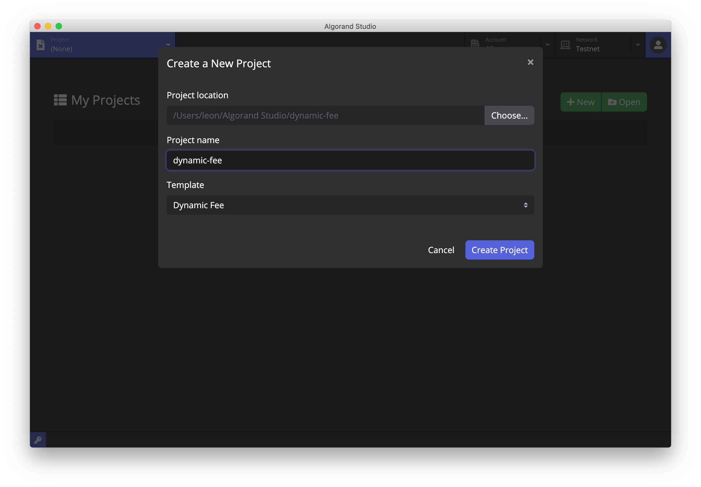
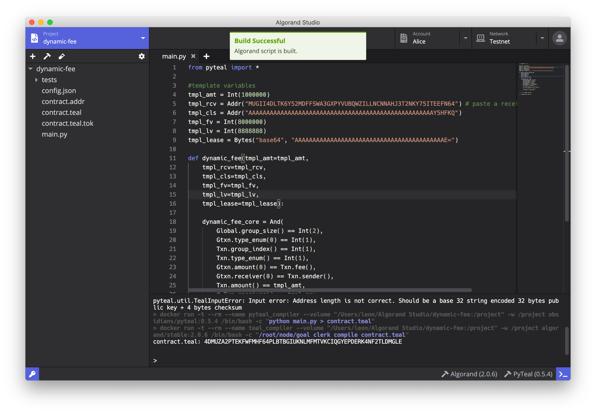

# [Algorand Studio Tutorial 2] Smart Contract Dynamic Fee 

We are now ready to talk about how to use Algorand Studio for ASC development. A general workflow for the development process includes

- Creating a project
- Coding
- Compilation
- Construct transaction(s) that execute(s) the smart contract
- Execution

## Algorand Smart Contract (ASC)

### New project from template (Dynamic Fee)

Switch to *Project* in the header to open the project list page. Click the *New* button, put in a project name and select a template you wish to use for the new project. Let's pick *Dynamic Fee* now. Then press *Create Project* to complete this process.

<p align="center">
  
</p>

The [Dynamic Fee](https://developer.algorand.org/docs/reference/teal/templates/dynamic_fee) smart contract allows third-party payment for the transaction fee. In [tutorial 1](tutorial-1.md), we made two transfer transactions and the fees were paid by the sender Alice. Using the Dynamic Fee contract we can specifiy an external account as the fee payer.

### Stateful vs stateless

There are two types of smart contracts in Algorand - stateful and stateless. We will mainly talk about stateless contracts in this tutorial. For more info, please refer to the [docs](https://developer.algorand.org/docs/features/asc1/).

### TEAL vs PyTeal

Algorand currently provides two programming language for ASC development - TEAL and PyTeal. TEAL (Transaction Execution Approval Language) is the native language for ASC. You may find full description of the language in the [docs](https://developer.algorand.org/docs/reference/teal/specification). TEAL is a low-level assemply-like language, so Algorand also developed PyTeal which allows developers to write Algorand smart contract using Python syntax. PyTeal serves to inteprete Python codes to TEAL for later compilation to binaries. You may find more information about PyTeal also in the [docs](https://developer.algorand.org/docs/features/asc1/teal/pyteal).

The Dynamic Fee example is written in PyTeal. Algorand Studio will use the configuration file `config.json` to store the programming language used in the project. The project template will provide this config file automatically (which also sets the compiler) so you usually don't need to worry about it.

### Compilation

Before compiling the Dynamic Fee project, we need to modify a line in the `main.py` file. Put in Charlie's address on Line 5.

You may notice there're two hammer buttons at the bottom of the editor window. They represent the PyTeal compiler and the TEAL compiler. Algorand Studio utilizes both to compile the Dynamic Fee smart contract. You should already installed both compilers in the Welcome screen. Otherwise, click the buttons and open their version managers to finish the installation.

<p align="center">
  
</p>

Press the hammer button in the toolbar (at the top of the file tree) to initiate the compilation process. PyTeal compiler will interpret and convert the `.py` file to `.teal` format. TEAL compiler will further compile it into a `.tok` binary and a `.addr` file that contains the address of the contract. In Algorand it doesn't require deployment right after compilation. You can directly deposit tokens to the smart contract using the address in the `.addr` file as the recipient. The `.tok` binary is only needed when you want to execute the contract program, for example in a withdrawal transaction.

### Modes of use

Stateless smart contracts are commonly used in [two scenarios](https://developer.algorand.org/docs/features/asc1/stateless/modes/):

- Contract Account: the smart contract will directly involve in the transaction, or specifically, it will be the sender since recipients don't need to do anything;
- Delegated Approval: the smart contract will act as a third-party to verify transactions between other accounts.

In the case of Dynamic Fee, the smart contract will only verify transactions between other accounts - the sender, the recipient and a third one that is going to pay the fee for the sender. Therefore, we are using the *delegated approval* mode here.

### Example transaction

Open `8.contract_delegrated.json` which contains an example to execute the smart contract. In the transaction array, the first item is a transfer of 0.001 ALGO from Bob (fee payer) to Alice (sender), and the second one is a transfer of 1 ALGO from Alice to Charlie (receiver).

You may find the second transaction is not signed by Alice. In fact, no `signers` is given here. However, we have provided the `lsig` which stands for [logic signature](https://developer.algorand.org/docs/features/asc1/stateless/modes/#logic-signatures), the method asking a smart contract to verify the transaction. In this example it contains the raw data of the smart contract code (remember we said before the code is only needed when the smart contract is going to be executed), and Alice's signature to make sure she agrees to withdraw from her account.

### Contract code

With an example transaction, it's easier to understand what the smart contract does. Let's now look at the PyTeal file `main.py`. In essense, the smart contract has prescribed a list of logic checks. 

``` py
dynamic_fee_core = And(
    Global.group_size() == Int(2), # the transaction array txns can only contains 2 items
    Gtxn[0].type_enum() == Int(1), # the 1st item in txns (txns[0]) is a pay transfer
    Txn.group_index() == Int(1), # the transaction signed by the contract is the 2nd item in txns (txns[1])
    Txn.type_enum() == Int(1), # txns[1] is a pay transfer
    Gtxn[0].amount() == Txn.fee(), # the amount transfered in txns[0] equals the fee in txns[1]
    Gtxn[0].receiver() == Txn.sender(), # the receiver of txns[0] must be the sender of txns[1]
    Txn.amount() == tmpl_amt, # the amount transfered in txns[0] is prescribed
    Txn.receiver() == tmpl_rcv, # the receiver of txns[1] is prescribed
    Txn.close_remainder_to() == tmpl_cls, # makes sure the transaction is not in the close remainder mode
    Txn.lease() == tmpl_lease # makes sure this contract cannot be used twice
)
```

With the parameters given in the contract file, the sender has to send *1 ALGO* to *Charlie* as the receiver and the fee payer has to send *the same amount of ALGO as the fee* to the *sender* (by default this is 0.001 ALGO). If we logically combine two transactions into one, it could be intepreted as a transfer transaction of 1 ALGO from Alice to Charlie while Bob pays for the transaction fee of 0.001 ALGO and Alice doesn't pay a fee as a consequence.

You can generate the same group of transactions using atomic transfer mentioned above and have Alice and Bob signing their transactions respectively, but it doesn't gurantee that the combination will act as planned because someone may cheat in the process. For example, the fee payer may pay less than the fee being charged, or the sender doesn't make a transfer to the receiver at all. In the blockchain world, we should act in a *trustless* way - we should not trust any other prople in the system. The Dynamic Fee smart contract can make sure everything goes as planed by codes so no one can manipulate it. That's why we need to use a smart contract to very such transactions.

### Execution

Press the test-tube button in the toolbar, choose `8.contract_delegated.json` and click *Run Test Transaction* button. Then wait for a while allowing transaction to complete. Once it completes, move to the explorer and refresh Alice's, Bob's and Charlie's pages respectively. You shall see Alice's balance decreased by 1 ALGO, Bob's decreased by 0.002 ALGO (since he paid fees for both Alice's transfer to Charlie as well as his to Alice), and Charlie's increased by 1 ALGO. In Alice's transaction history you will also see the consequence with one outbound transfer of 1 ALGO to Charlie and 0.001 ALGO inbound transfer from Bob.

## Next

In the [next tutorial](tutorial-3.md), we will talk about the Algorand Standard Asset (ASA) model through a more sophisticated smart contract [LimitOrder](https://developer.algorand.org/docs/reference/teal/templates/limit_ordera/).
