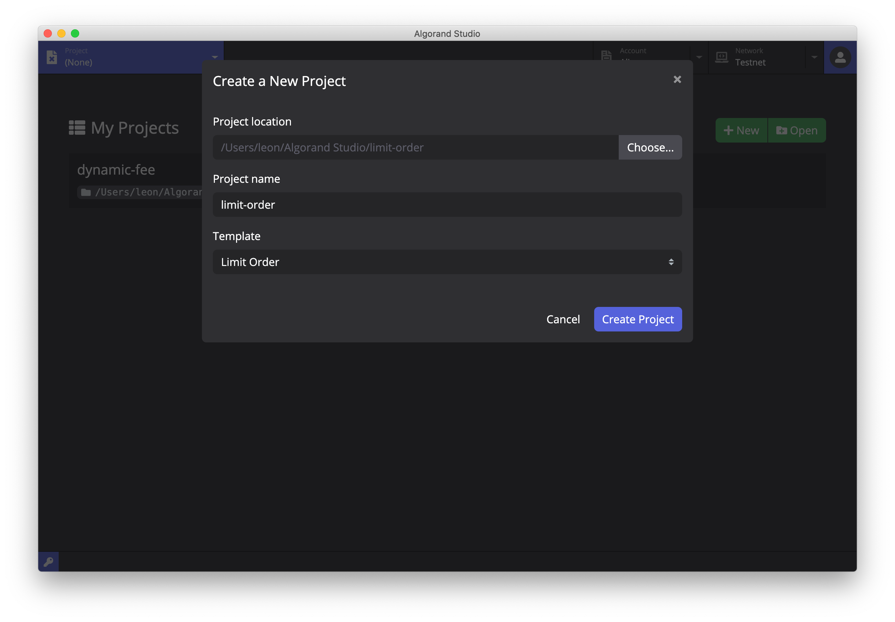
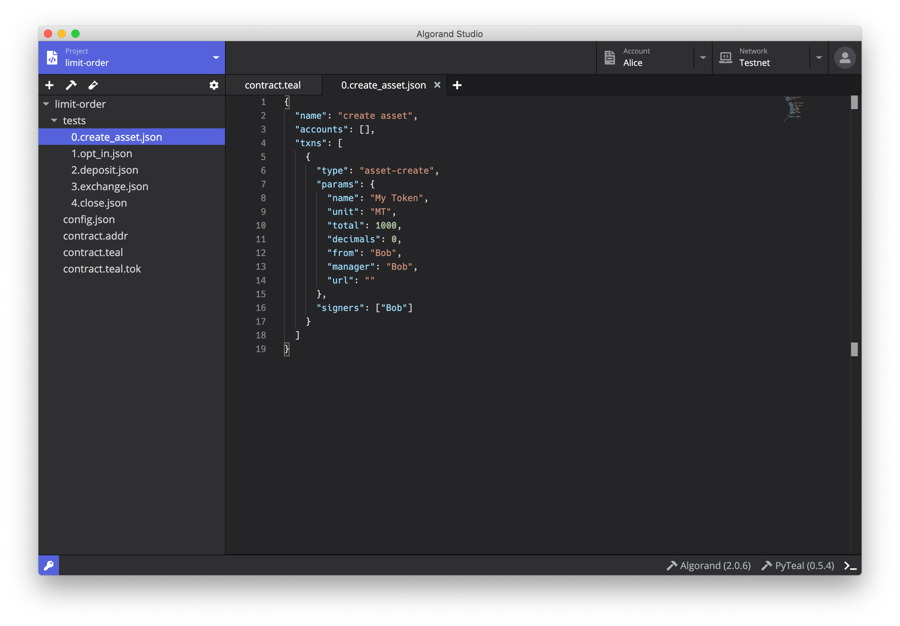
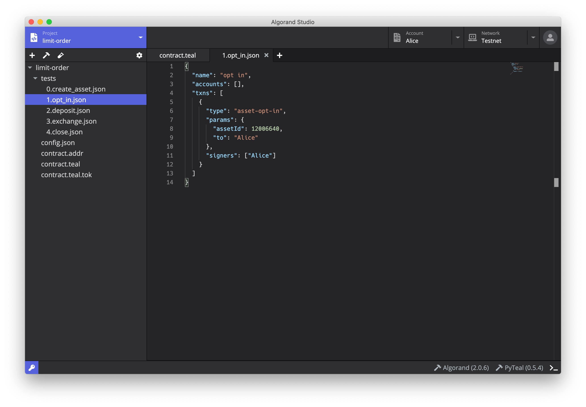
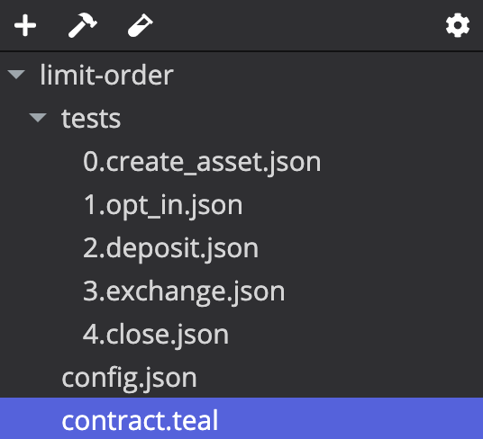
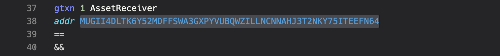
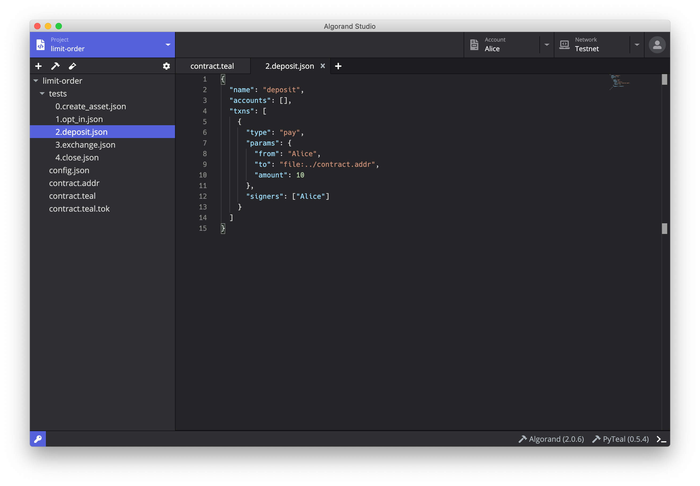
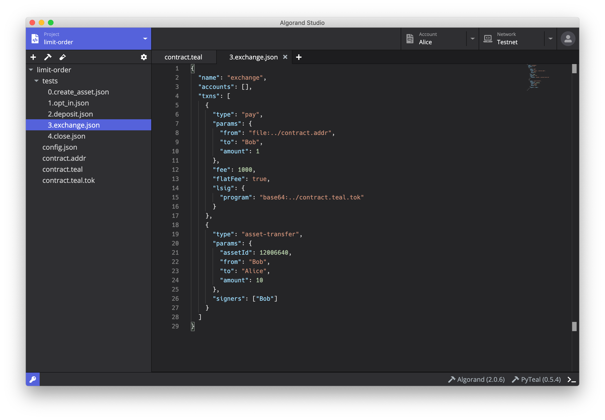
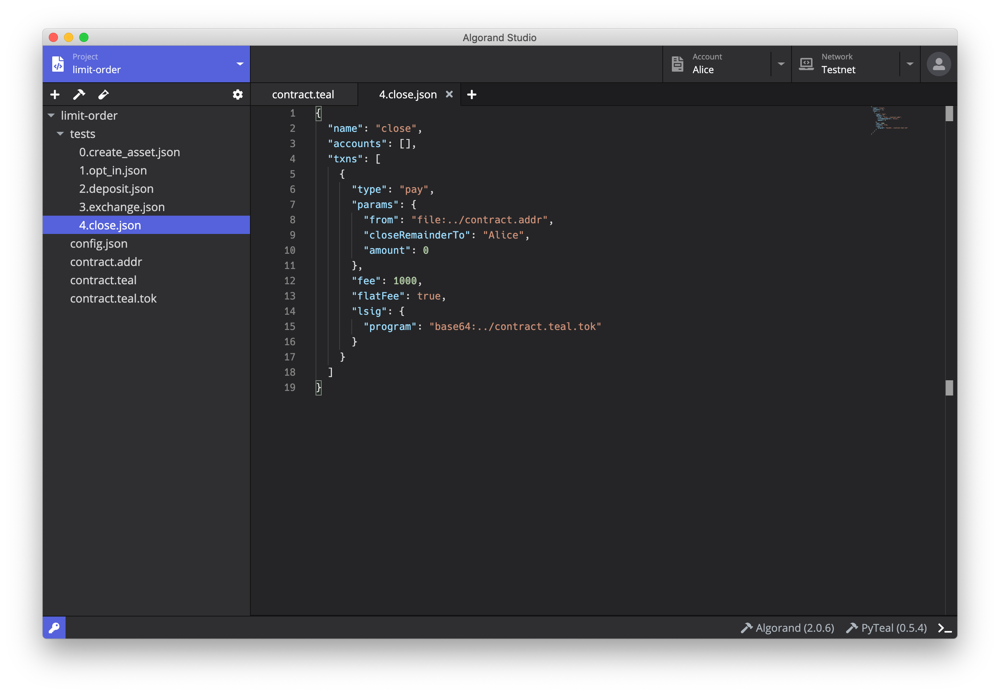

# [Algorand Studio Tutorial 3] Smart Contract Limit Order

In this tutorial, we will talk about the [Algorand Standard Asset](https://developer.algorand.org/docs/features/asa) (ASA) model and work through the Limit Order smart contract. You will learn

- The ASA model of Algorand
- Issuing your own ASA
- Using the Limit Order smart contract to exchange ALGO for an ASA at a specified rate

## Algorand Standard Asset

Algorand Standard Asset is an Algorand built-in features to issue customized tokens, including both fungible and non-fungible types of assets.

### ASA transactions

Create a new project from the Limit Order template. Put in project name and click *Create Project* button.

  

You will find some ASA related transactions under the `tests` folder.

- `0.create_asset.json`
- `1.opt_in.json`
- `3.exchange.json` (the second item in the `txns` array)

A complete lifecycle for an ASA usually contains

- Create: create the ASA and give the asset parameters
- Opt in: register to allow receiving the ASA
- Transfer: transfer the ASA between accounts
- Other: freeze, revoke, clawback, and destroy

For more ASA transaction types, please refer to [the docs](https://developer.algorand.org/docs/features/asa/#asset-functions).

### Creat an ASA

Open the file `0.create_asset.json`. This is a transaction that creates a new asset named `My Token` for Bob. This asset has `MT` as its symbol and the total amount is `1000 MT`. Click the test-tube button on the toolbar and run this transaction. Once the transaction completes, switch to the explorer and open Bob's page, you shall see `My Token` is created and `1000 MT` is issued to Bob's account. Take a note for the asset ID which we will use later.

  

### Opt in

The file `1.opt_in.json` described a transaction which is initiated by Alice to allow receiving an asset. Copy and paste the asset ID we just created into the file, and run this transaction. You shall see in Alice's page in the explorer that she also has `0 MT` added to her asset list. From now on, other people can send `My Token` asset to Alice.

  

### Asset transfer

The project doesn't provide a separate asset transfer transaction. However, you can look at the second part in `3.exchange.json` for an example. You can run it individually by creating a new JSON object. We leave this as an exercise.

## Limit Order

[Limit Order](https://developer.algorand.org/docs/reference/teal/templates/limit_ordera) is a smart contract to exchange ALGO for an ASA, which guarantees the exchange rate between ALGO and the asset.

Limit Order is written in native TEAL language. The project contains the source code `contract.teal`, a config file `config.json` as well as example transactions in the `tests` folder. 

  

The five files in `tests` are actually the steps to use Limit Order. We justed executed the first two transactions. The following three are all related to the smart contract

- `2.deposit.json`: Alice deposits 10 ALGO into the smart contract;
- `3.exchange.json`: Bob exchanges 10 unites of `My Asset` for `1 ALGO`;
- `4.close.json`: Return the remaining ALGO to Alice.

In the file `3.exchange.json`, copy and paste the asset ID for `My Token` we created.

The official docs has provided a [detailed walkthrough](https://developer.algorand.org/docs/reference/teal/templates/limit_ordera/#code-overview) for Limit Order so we will skip this part.

### Compilation

Before you compile the contract, we need to modify a few lines in the contract code.

First, open the *Keypair Manager* through the key button at the bottom left corner. Copy Alice's address and copy it to `contract.teal` file in line 38 and line 72. Overwrite both addresses with Alice's address as they specify Alice as the only recipient allowed in this contract.

  

Now, click the hammer button to start compilation. Upon completion, you will find two outputs, `contract.teal.tok` and `contract.addr` created under the project folder.

### Execution

Once compilation completes, you shall start to make use of Limit Order contract. Remember in tutorial 2 we said there are two [modes of use](tutorial-2#modes-of-use) for stateless smart contracts. The example in tutorial 2 was executed in *delegated approval* mode, while for Limit Order we will use *contract account* mode.

In `2.deposit.json`, Alice deposits `10 ALGO` to the smart contract whose address is referenced through the `.addr` file generated in compilation. In fact, each smart contract will have an associated address. This is actually the hash of the compiled binary so it guarantees addresses are distinct for different smart contracts. You can freely send ALGO or ASA tokens to a smart contract using its address, but if you want to withdraw from it (we will do it soon) you need to pass the logic checks prescribed in the smart contract.

  

Next, let's perform the exhange action, which is written in `3.exchange.json`. Bob wants to exchange `10 MT` for Alice's `1 ALGO`, so he sends `10 MT` to Alice and requests the smart contract send `1 ALGO` to him. The smart contract will verify all details for the transaction and make sure it happens as planned. Run this transaction and you shall see `10 MT` deducted while `1 ALGO` added in Bob's account.

  

We can execute the exchange transaction for more times to gradually fill the order. You can try it by adjusting the amount to exchange, or even the person coming for the exchange.

Before someone has fully filled the order, Alice may want to close it and withdraw the remaining ALGO. She can do that using the transaction described in `4.close.json`. Here we are using a special feature for making transfers called *close remainder*, which is send all remaining balance to the given account. The Limit Order smart contract has given Alice the privilege for closing the order so she is the only one who can initiate this action. Try running this transaction and you shall see the remaining ALGO in the smart contract will be sent back to Alice's account.

  

